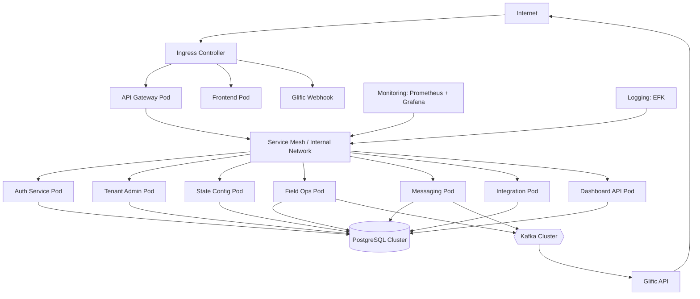

**6. Deployment Architecture**

**6.1 Cloud-neutral Principles**

* Runs on any **Kubernetes** cluster (on-prem, any cloud).
* No cloud-vendor-proprietary managed services required.
* Infra described using **Helm** + optionally **Terraform**, keeping providers pluggable.

**6.2 Environments**

* dev
* staging
* prod

**6.3 Components**

* **Kubernetes cluster**
* **PostgreSQL cluster** (multi-AZ/high availability)
* **Kafka cluster** (e.g., Bitnami Helm chart or cloud-neutral Kafka distribution)
* **Object storage** (S3-compatible, for images, file dumps)
* **Reverse proxy / ingress** (NGINX Ingress, Traefik, etc.)
* **Monitoring**: Prometheus + Grafana
* **Logging**: EFK / ELK stack

**6.4 Network Layout**

* Public ingress only to:
  + API Gateway (REST APIs)
  + Public dashboard frontend
  + Glific webhook endpoints
* All internal services and databases in **private network**.
* TLS for all external endpoints.

**6.5 Deployment Architecture Diagram**

**6.6 Channels Deployment Considerations**

The deployment must support the five channels from the PRD while the initial delivery focuses on Channel 1 (BFM). Below are infra considerations for each channel and guidance for mock deployments:

- **Channel 1 — BFM reading (WhatsApp/Glific):**
  - Public webhook endpoints exposed through the ingress controller with TLS and rate limiting.
  - Messaging Orchestrator pods process webhooks and push canonical submissions to Field Operations.
- **Channel 2 — Electricity consumption:**
  - Integrations with utility APIs or periodic file imports; may require scheduled worker pods and secure egress to provider endpoints.
  - For mock mode, deploy a small `mock-electricity-adapter` in the `mocks` namespace that posts canonical submissions.
- **Channel 3 — Pump running duration:**
  - Telemetry ingestion endpoints or import workers; consider buffering in object storage for large payloads.
  - Provide `mock-runtime-adapter` for tests.
- **Channel 4 — Inform (manual/state IT flags):**
  - Secure APIs for State IT systems or admin UIs for manual entries; use S3-compatible storage for bulk uploads.
  - Provide a `mock-inform-adapter` to simulate state flags and manual reports.
- **Channel 5 — IoT devices:**
  - Telemetry ingestion (MQTT/HTTP), device registry, and scaling considerations. For the current scope, a `mock-iot-adapter` can generate sample telemetry.

Mock deployment guidance:

- Create a `mocks` namespace with lightweight adapters for Channels 2–5. These adapters should expose HTTP endpoints and/or scheduled jobs that emit canonical submission payloads to the Messaging Orchestrator or the Field Operations ingestion API.
- Mock adapters can be simple containers (Node/Python) and do not require full production-grade infra.
- Ensure monitoring (basic Prometheus metrics) and logs for mock adapters to validate end-to-end flows.

See the PRD for channel definitions and expected wire formats: https://docs.google.com/document/d/1OPLgQ0g7yTTT-5YP2J_RY85a-X_uU0_bD3nb4fQ3B7E/edit