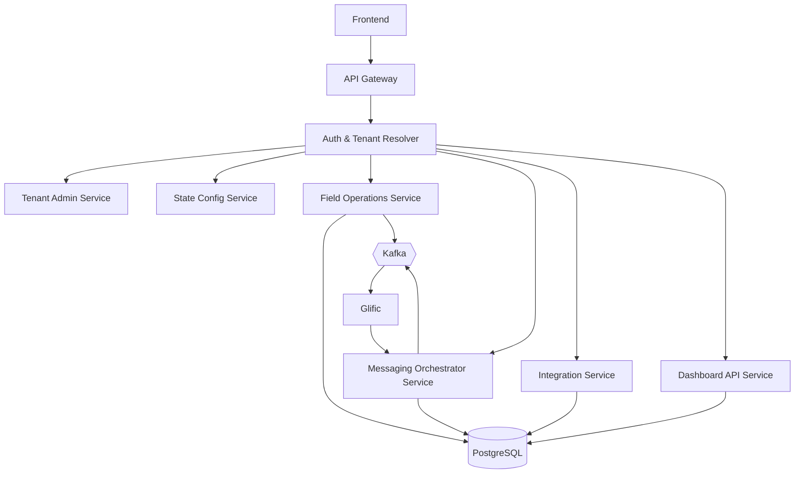

**5. Technical Architecture**

**5.0 Software Architecture Diagram**

```mermaid
graph TD
    A[Frontend (React)] --> B[API Gateway]
    B --> C[Microservices Backend]
    C --> D[(PostgreSQL Database)]
    C --> E{{"Kafka Messaging"}}
    E --> F[Glific WhatsApp]
    F --> B
    G[State IT Systems] --> C
```

**5.1 Architectural Style**

* **Microservices-based backend**, implemented in **Java + Spring Boot**.
* **Mono-repo** structure:
  + /services/field-operations-service
  + /services/messaging-orchestrator-service
  + /services/tenant-admin-service
  + /services/state-config-service
  + /services/integration-service
  + /services/dashboard-api-service
  + /frontend/ (React + ECharts)
  + /libs/ (shared DTOs, constants, common code)
  + /infra/ (Helm, manifests, Terraform, etc.)
* Asynchronous communication via **Kafka** for:
  + Event-based notifications.
  + Decoupling ingestion/outbound messaging and processing.
* **Keycloak** for IAM.

**5.2 Key Backend Services**

1. **API Gateway / Edge Service**
   * Terminates HTTPS.
   * Routes traffic to internal services.
   * Handles API versioning and rate limiting.
2. **Auth & Tenant Resolver (Lightweight) using Keycloak**
   * Authentication and Authorization
   * Mostly needed for admin/config UIs.
   * Dashboard UIs (public) may be **URL-token based** or unauthenticated.
   * Determines tenant\_id from:
     + URL / subdomain (e.g., /tenant/{tenantSlug}), or Message Header or
     + Token for admin users.
3. **Tenant Admin Service**
   * Manages tenants (states).
   * Assigns State System Admins.
   * Stores tenant metadata (name, code, country mapping, default configs).
4. **State Config Service**
   * Manages:
     + State languages.
     + Water norms.
     + Thresholds, anomaly rules.
     + Escalation rules.
     + Message templates & nudges.
     + WhatsApp/Glific configuration per tenant.
   * Exposes APIs for the Messaging Orchestrator & Dashboards to query config.
5. **Field Operations Service (Unified with Submodules)**
   * Domain submodules:
     + **Scheme & Location Management**
     + **Pump Operator assignments**
     + **Ingress reading submissions (BFM reading, other channels)**
     + **Pump operation status**
     + **Pump Operator performance calculations**
     + **Section Officer views**
       1. Handles logic like:
          1. water\_quantity = BFM\_reading(today) - BFM\_reading(yesterday)
          2. Top/bottom Pump Operators (7/15/30 days).
          3. Absent Pump Operators (no submissions).
6. **Messaging Orchestrator Service**
   * Contains the **rules engine**: "what messages to send, when, to whom".
   * Reads configuration from State Config Service / DB.
   * Outbound:
     + Calls **Glific(or other service providers) APIs** to send messages.
   * Inbound:
     + Exposes webhook endpoints for Glific(Service provider) to post messages.
     + Emits events to Kafka for downstream processing (e.g., logging, analytics).
7. **Integration Service**
   * Handles **data ingestion from State IT systems**:
     + One-time dump APIs or file uploads.
     + Periodic/real-time sync APIs.
   * Validates, deduplicates, and persists:
     + Users (pump operators, Section Officers, AEE, EE…).
     + Schemes, locations, pumps.
   * Records sync statuses and error logs for State System Admin to monitor.
8. **Dashboard API Service**
   * Read-only APIs for:
     + State public dashboards.
     + Country-level dashboards.
   * Implements:
     + Geo & departmental drilldown.
     + Status color logic (green, orange, red, dark red).
     + Daily submission percentages, continuity metrics.
     + Comparative views across states/districts.
   * Uses **ECharts-friendly API responses** for visualization.
9. **Country Aggregator Logic**
   * Provided as part of Dashboard API Service or a microservice:
     + Aggregates tenant\_id-scoped data across all tenants.
     + Powers **country-level dashboard**.

**5.3 Data Flow Examples**

**Field submission via WhatsApp**

1. Pump Operator sends BFM reading or status via WhatsApp.
2. Glific receives and posts to JalSoochak **Messaging Orchestrator Webhook**.
3. Orchestrator parses and validates message.
4. Orchestrator posts to **Field Operations Service** (/submissions endpoint).
5. Field Operations Service stores submission in PostgreSQL.
6. Events pushed to Kafka (field.submission.created).
7. Dashboard queries use these submissions in near real-time.

**Admin configuration update**

1. State System Admin updates escalation rule in React UI.
2. Frontend calls State Config Service API.
3. Config persists to DB and optionally publishes config.updated events to Kafka.
4. Messaging Orchestrator consumes updated rules.

**5.4 Technical Architecture Diagram**



  **5.5 Channels**

  The system must accommodate five input channels per the PRD. These channels form the basis for calculating water supply quantity and regularity. The channels are:

  - **BFM reading basis (Channel 1)** — BFM counter readings submitted by Pump Operators (WhatsApp/BFM forms). This is the primary channel and the focus of the current implementation.
  - **Electricity consumption basis (Channel 2)** — Meter or utility-provided consumption data to infer pump usage.
  - **Pump running duration basis (Channel 3)** — Pump runtime telemetry or derived durations from other signals.
  - **Inform basis (Channel 4)** — Manual reports or state IT system flags indicating supply status.
  - **IoT devices basis (Channel 5)** — Sensor/IoT telemetry reporting flows or status.

  Scope & implementation approach:

  - Current scope: fully implement Channel 1 (BFM readings) including ingestion, validation, storage, events, and dashboard integration.
  - Mock adapters: provide lightweight mock implementations for Channels 2–5 that emit canonical submissions compatible with the Field Operations ingestion API. These mocks allow end-to-end testing of the Messaging Orchestrator, Field Operations, Kafka events, and dashboards without full provider integrations.
  - Messaging Orchestrator: implement a channel-adapter abstraction. Each adapter converts channel-specific payloads into the canonical submission format consumed by the Field Operations Service.
  - Configuration: per-tenant channel enablement and channel-specific thresholds live in the State Config Service.

  Developer notes:

  - Add tests and sample datasets for mock adapters under `/tests/mocks/channels/`.
  - Use a feature-flag or environment variable to enable mock adapters in non-prod environments.